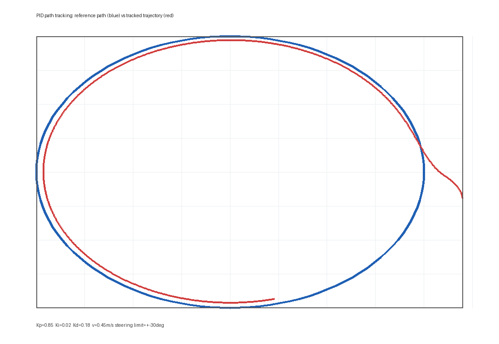

# 控制实验报告

人工智能2302  蒋梓轩  
人工智能2302  汪翌秦  
人工智能2302  孙靖淞

## 一、实验目的

本次实验在前几次实验完成的建图、定位与路径规划基础上，进一步关注阿克曼底盘的运动控制问题。实验目标包括：理解车辆坐标系、自行车运动学模型和阿克曼转向几何之间的关系；掌握车辆转向角与航向角速度之间的转换公式；修改底盘里程计积分方式，使 `/odom` 话题符合阿克曼车辆的非完整约束；在 PID 仿真环境中修改参考路径、调节控制参数并完成路径跟踪；最后将全局规划器发布的路径作为 PID 循迹控制的参考线接口。

控制实验的核心不是单独让车辆动起来，而是把“路径规划给出参考线”和“底盘控制执行参考线”之间的数据闭环打通。规划层输出的是一串空间位姿点，控制层需要根据当前里程计位姿计算横向误差、输出前轮转角，并在转角限幅和车辆运动学约束内尽量稳定地跟踪参考路径。

## 二、车辆运动模型

### 2.1 车辆坐标系与阿克曼转向

车辆坐标系采用右手坐标系，原点位于车辆后轴中心，`x` 轴指向车头正前方，`y` 轴指向车辆左侧，`z` 轴垂直底盘向上。阿克曼底盘的后轮不参与转向，前轮转角决定车辆瞬时转弯半径。为了避免四个轮胎在转弯时发生明显侧滑，内外侧前轮转角并不完全相同，但在控制器中通常采用自行车模型，将前轮等效为一个转向轮，将后轮等效为一个固定轮。

在低速导航实验中，可以把参考点选在后轴中心。若车辆纵向速度为 `v`，前轮等效转角为 `delta`，轴距为 `L`，车辆航向角速度为：

```text
omega = v * tan(delta) / L
```

反过来，如果上层控制器给出期望航向角速度，也可以换算为前轮转角：

```text
delta = atan(L * omega / v)
```

当 `v` 接近 0 时，转角换算容易出现数值不稳定，因此代码中需要对速度、转角和输出进行限幅。本次实验采用 `L = 0.313 m`，前轮转角限幅为 `+-0.523599 rad`，约等于 `+-30 deg`。

### 2.2 控制量与状态量关系

自行车模型的状态量可表示为 `[x, y, phi, v]`，控制量可表示为 `[delta, a]`。其中 `x, y` 表示车辆在 `odom/map` 坐标系中的位置，`phi` 表示航向角，`v` 表示纵向速度，`delta` 表示前轮转角，`a` 表示纵向加速度。离散时间下，简化后轴模型为：

```text
x(k+1)   = x(k) + v(k) * cos(phi(k) + delta_phi / 2) * dt
y(k+1)   = y(k) + v(k) * sin(phi(k) + delta_phi / 2) * dt
phi(k+1) = phi(k) + omega(k) * dt
v(k+1)   = v(k) + a(k) * dt
omega(k) = v(k) * tan(delta(k)) / L
```

这里使用 `phi + delta_phi / 2` 的圆弧中点法积分，比直接使用当前航向角积分更适合短时间内有转向的车辆运动。它体现了阿克曼底盘的非完整约束：车辆不能像全向底盘一样直接产生横向速度，局部坐标系中的 `vy` 应当近似为 0，横向位移来自车辆航向变化后的纵向运动积分。

## 三、代码实现

### 3.1 底盘里程计修改

实验指导书要求根据阿克曼底盘运动模型修改 `wheeltec_robot.cpp` 并发布 `/odom`。本次修改后的主要逻辑如下：

```text
steering_angle = clamp(raw_z, -max_steering_angle, max_steering_angle)
omega = linear_x * tan(steering_angle) / wheel_base
delta_s = linear_x * dt
delta_theta = omega * dt
x += delta_s * cos(yaw + delta_theta / 2)
y += delta_s * sin(yaw + delta_theta / 2)
yaw = normalize(yaw + delta_theta)
```

同时修正了原文件中 TF 平移量误用速度值的问题，`odom -> base_footprint` 的平移现在使用累计位姿 `Robot_Pos.X/Y`，`Odometry.pose.pose.position.z` 保持为 0，航向由四元数表达。构造函数中重新启用 `odom_publisher`，使节点能够持续发布 `/odom` 话题。

### 3.2 PID 循迹控制器

本次实验合入了 `demo06_Control_Sim.zip` 中的 `pid_controller` 与 `styx_msgs` 两个 ROS 包，并对控制器做了整理。`waypoint_loader.py` 从 CSV 文件读取参考路径，发布 `/base_waypoints` 和 `/base_path`；`ebotController` 订阅 `/odom` 获取当前位姿，将目标参考点从 `odom` 坐标系转换到 `base_footprint` 坐标系，在车体坐标系下取目标点的 `y` 值作为横向误差。

PID 控制器输出前轮转角：

```text
delta = Kp * e_y + Ki * integral(e_y) + Kd * derivative(e_y)
```

其中 `e_y` 是带符号横向误差。目标点在车辆左侧时 `e_y > 0`，控制器输出正转角；目标点在车辆右侧时 `e_y < 0`，控制器输出负转角。输出转角被限制在 `+-0.523599 rad` 内，避免超过阿克曼转向角范围。仿真节点 `vehicle_sim.py` 将 `cmd_vel.angular.z` 解释为前轮转角，再使用 `omega = v*tan(delta)/L` 积分车辆运动。

### 3.3 参考路径与全局路径接口

为了完成“修改 PID 仿真实验路径”的要求，本次提交新增了三条可选路径：

```text
pid_controller/waypoints/circle.csv
pid_controller/waypoints/square.csv
pid_controller/waypoints/heart.csv
```

默认启动文件使用圆形路径：

```text
roslaunch pid_controller simple_follow.launch
```

也可以在启动时切换路径与参数：

```text
roslaunch pid_controller simple_follow.launch \
  path_file:=$(rospack find pid_controller)/waypoints/heart.csv \
  kp:=0.85 ki:=0.02 kd:=0.18 target_speed:=0.45
```

为了和导航栈连接，控制器还增加了 `global_path_topic` 参数，默认订阅 `/move_base/GlobalPlanner/plan`。当全局规划器发布 `nav_msgs/Path` 时，PID 控制器可以直接把该路径作为参考线，而不必只依赖 CSV 文件。

## 四、PID 参数调节现象

本次实验采用默认参数 `Kp=0.85, Ki=0.02, Kd=0.18, target_speed=0.45 m/s, lookahead_distance=0.9 m`。在圆形路径上，车辆可以稳定进入目标曲线并保持较小横向误差。生成的轨迹图见图 1，蓝色曲线为参考路径，红色曲线为简化自行车模型下的跟踪轨迹。



不同 PID 参数的影响如下：

- 只增大 `Kp` 时，车辆对横向误差响应更快，能更积极地靠近参考线；但 `Kp` 过大时，转角容易频繁达到限幅，车辆在参考线两侧振荡，圆形路径上表现为轨迹外扩和来回摆动。
- 减小 `Kp` 时，车辆转向较柔和，轨迹更平滑；但误差收敛变慢，进入弯道时容易出现明显滞后，方形路径转角处会出现切角现象。
- 增大 `Kd` 可以提高阻尼，抑制比例项带来的超调，使车辆更快稳定在参考线附近；但 `Kd` 过大时会放大里程计噪声和离散采样误差，导致转角指令抖动。
- 加入较小 `Ki` 可以消除持续扰动或模型误差带来的稳态偏差；但 `Ki` 过大时积分项累积过快，在转弯或路径切换时出现积分饱和，车辆会过度修正。
- 前视距离过小会让控制器盯住车身附近的点，转向动作激进，容易振荡；前视距离过大会让车辆提前追远处目标点，轨迹更平顺，但弯道处更容易切角。

综合实验现象，较合适的调参顺序是：先仅调 `Kp` 让车辆能跟上路径，再加入 `Kd` 抑制超调，最后只保留很小的 `Ki` 修正残余稳态误差。

## 五、思考题

### 5.1 车辆转向角和角速度之间的转化关系

在自行车模型中，车辆前轮转角 `delta` 决定瞬时转弯半径。若车辆以后轴中心为参考点，轴距为 `L`，纵向速度为 `v`，则车辆绕 `z` 轴的航向角速度为：

```text
omega = v * tan(delta) / L
```

这个公式说明：在同一转角下，速度越大，航向角变化越快；在同一速度下，转角越大，转弯半径越小，角速度越大。反向换算为：

```text
delta = atan(L * omega / v)
```

实际控制时需要注意三个限制。第一，阿克曼车辆的转角有限，实验中一般限制在 `-30 deg` 到 `30 deg`。第二，当速度接近 0 时不能直接使用 `atan(L*omega/v)`，否则会出现数值突变。第三，如果上层控制器发布的是 `cmd_vel.angular.z`，必须明确它表示“角速度”还是“前轮转角”。本次 PID 仿真中约定 `angular.z` 表示前轮转角，仿真车模型再换算为角速度。

### 5.2 自行车模型中控制量和状态量之间的变化关系

自行车模型的状态量为 `[x, y, phi, v]`，控制量为 `[delta, a]`。其中 `delta` 通过 `omega = v*tan(delta)/L` 改变航向角 `phi`，航向角再决定下一时刻的 `x/y` 积分方向；`a` 直接改变纵向速度 `v`，速度又同时影响纵向位移和航向角变化速度。

因此控制量和状态量不是相互独立的。转角 `delta` 并不会直接产生横向速度，而是通过改变航向角，让车辆在后续纵向运动中逐渐产生横向位置变化；加速度 `a` 不只影响车辆快慢，也会改变同一转角下的角速度大小。对于路径跟踪控制，横向误差大时可以增大转角让车辆更快对准参考线，但速度越高，同样转角带来的角速度越大，越容易超调。因此 PID 参数、目标速度和转角限幅必须一起考虑。

## 六、结论

本次实验完成了控制实验所需的代码和报告整理：保存了 lec06 控制实验 PDF 与 `demo06_Control_Sim.zip` 原始资料；将 PID 仿真所需的 `pid_controller`、`styx_msgs` 合入工作空间；新增圆形、方形、心形三条参考路径；将仿真车辆模型改为阿克曼前轮转角输入；修改实车底盘里程计，使其按自行车模型发布 `/odom`；并在 PID 控制器中加入全局路径订阅接口，使全局规划器输出的 `nav_msgs/Path` 能作为循迹参考线。

实验表明，阿克曼车辆的控制重点在于正确处理“前轮转角、航向角速度、车辆位姿积分”之间的关系。PID 控制能够用较简单的形式完成路径跟踪，但参数需要结合车辆速度、前视距离和转角限幅一起调整。比例项决定响应速度，微分项改善阻尼，积分项修正稳态偏差；三者配合后，车辆可以在仿真环境中较稳定地跟踪给定参考路径。
